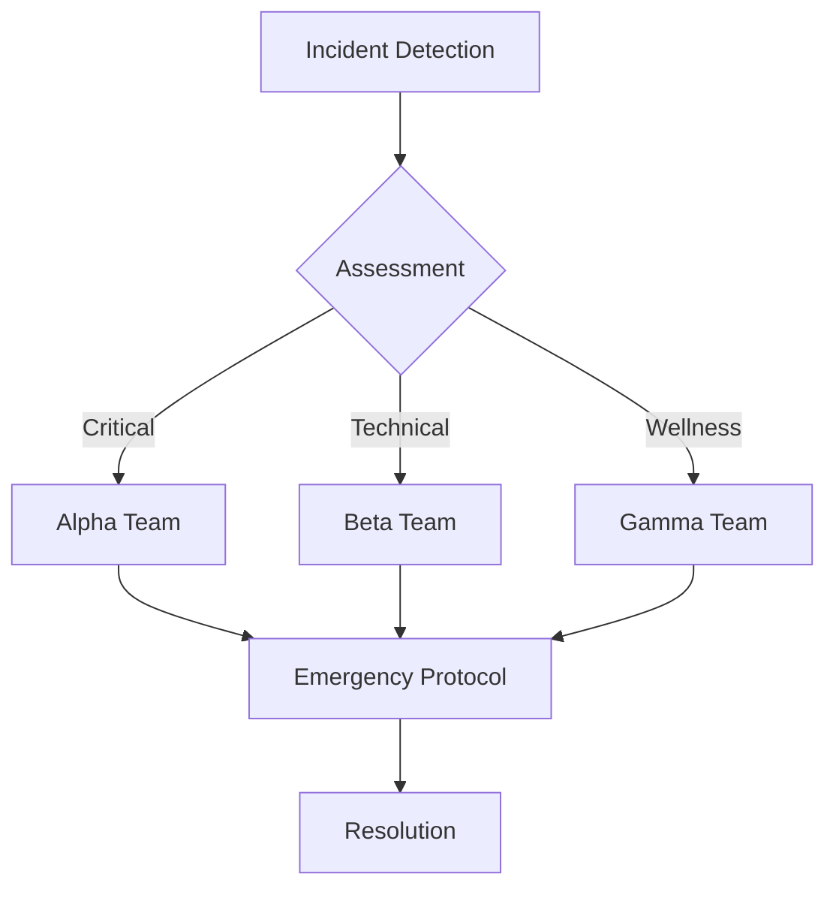

# Emergency Response Procedures
**Classification:** RESTRICTED  
**Last Updated:** 2025-08-12 09:49:46 UTC  
**Author:** @synapsecomics  
**Protocol:** PARANOID  
**Verification:** 〈8〉

## Emergency Categories

### 1. Critical Incidents
```yaml
critical_events:
  security_breach:
    response_time: "15 minutes"
    team: "ALPHA"
    protocol: "LOCKDOWN"
    notification: "IMMEDIATE"

  system_failure:
    response_time: "30 minutes"
    team: "BETA"
    protocol: "RECOVERY"
    notification: "URGENT"

  wellness_crisis:
    response_time: "15 minutes"
    team: "GAMMA"
    protocol: "SUPPORT"
    notification: "IMMEDIATE"
```

### 2. Major Incidents
```yaml
major_events:
  performance_issues:
    response_time: "1 hour"
    team: "BETA"
    protocol: "STABILIZE"
    notification: "HIGH"

  data_concerns:
    response_time: "2 hours"
    team: "ALPHA"
    protocol: "PROTECT"
    notification: "HIGH"

  community_issues:
    response_time: "2 hours"
    team: "GAMMA"
    protocol: "MODERATE"
    notification: "HIGH"
```

## Response Protocols

### 1. Immediate Response
```yaml
immediate_actions:
  security:
    1: System lockdown
    2: Threat assessment
    3: Containment measures
    4: User protection

  technical:
    1: System stabilization
    2: Impact assessment
    3: Service restoration
    4: User notification

  wellness:
    1: Crisis intervention
    2: Support activation
    3: Resource deployment
    4: Community protection
```

### 2. Communication Plan
```yaml
communication_flow:
  internal:
    - Emergency team
    - Technical staff
    - Support team
    - Management

  external:
    - Affected users
    - Community leaders
    - Support partners
    - Public relations

  methods:
    - Emergency alerts
    - System notifications
    - Email updates
    - Community posts
```

## Team Structure

### 1. Emergency Teams
```yaml
team_composition:
  alpha_team:
    focus: "Security"
    members:
      - Security Lead
      - System Architect
      - Response Team
      - Communications

  beta_team:
    focus: "Technical"
    members:
      - Technical Lead
      - System Engineers
      - Support Staff
      - Operations

  gamma_team:
    focus: "Wellness"
    members:
      - Support Lead
      - Crisis Team
      - Community Managers
      - Resource Coordinators
```

### 2. Response Chain


## Recovery Procedures

### 1. System Recovery
```yaml
recovery_steps:
  immediate:
    - Damage assessment
    - System stabilization
    - Critical restoration
    - Service verification

  short_term:
    - Full restoration
    - Data verification
    - System hardening
    - Performance optimization

  long_term:
    - System improvement
    - Prevention measures
    - Process updates
    - Documentation
```

### 2. Community Recovery
```yaml
community_recovery:
  support:
    - Resource activation
    - Community outreach
    - User assistance
    - Regular updates

  restoration:
    - Service normalization
    - Trust rebuilding
    - Community healing
    - Feature restoration

  prevention:
    - System hardening
    - Process improvement
    - Training updates
    - Documentation
```

## Documentation Requirements

### 1. Incident Documentation
```yaml
documentation_needs:
  immediate:
    - Incident details
    - Initial response
    - Action taken
    - Impact assessment

  ongoing:
    - Response timeline
    - Resource allocation
    - Decision points
    - Status updates

  post-incident:
    - Final report
    - Lessons learned
    - Recommendations
    - Process updates
```

### 2. Review Process
```yaml
review_procedures:
  analysis:
    - Response effectiveness
    - Resource adequacy
    - Communication efficiency
    - Process compliance

  improvement:
    - Process updates
    - Training needs
    - Resource allocation
    - System enhancement

  verification:
    - Protocol updates
    - System testing
    - Team readiness
    - Documentation review
```

---
**VERIFICATION HASH:** [REDACTED]  
**SECURITY LEVEL:** ALPHA  
**ACCESS:** RESTRICTED  

© 2025 Synapse Comics. All Rights Reserved.
〈8〉