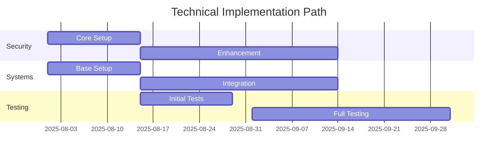

# Implementation Timeline
**Classification:** RESTRICTED  
**Last Updated:** 2025-08-12 09:51:11 UTC  
**Author:** @synapsecomics  
**Protocol:** PARANOID  
**Verification:** 〈8〉

## Phase 1: Foundation (Q3 2025)

### Week 1-2 (August 1-14)
```yaml
initial_setup:
  security:
    - Core protocols
    - Access controls
    - Encryption systems
    - Monitoring setup
    status: "COMPLETE"
    verification: "ALPHA"

  infrastructure:
    - Base systems
    - Network setup
    - Database configuration
    - Backup systems
    status: "COMPLETE"
    verification: "BETA"

  timeline:
    start: "2025-08-01"
    end: "2025-08-14"
    current_status: "ON TRACK"
```

### Week 3-4 (August 15-31)
```yaml
core_implementation:
  systems:
    - User management
    - Data handling
    - Support tools
    - Community features
    status: "IN PROGRESS"
    completion: "85%"

  testing:
    - Security validation
    - Performance testing
    - Integration checks
    - User acceptance
    status: "ONGOING"
    completion: "70%"

  timeline:
    start: "2025-08-15"
    end: "2025-08-31"
    current_status: "ON TRACK"
```

## Phase 2: Enhancement (Q3-Q4 2025)

### September 2025
```yaml
system_enhancement:
  features:
    - Advanced AI integration
    - Enhanced security
    - Community tools
    - Support systems
    start: "2025-09-01"
    end: "2025-09-30"

  deployment:
    week1: "AI Core"
    week2: "Security Updates"
    week3: "Community Features"
    week4: "Support Integration"
```

### October 2025
```yaml
expansion_phase:
  scaling:
    - System expansion
    - Performance optimization
    - Resource scaling
    - Community growth
    start: "2025-10-01"
    end: "2025-10-31"

  implementation:
    week1: "Scale Infrastructure"
    week2: "Optimize Systems"
    week3: "Expand Resources"
    week4: "Community Launch"
```

## Phase 3: Optimization (Q4 2025)

### November-December 2025
```yaml
optimization_phase:
  technical:
    - Performance tuning
    - Security hardening
    - System optimization
    - Resource management
    timeline: "2025-11-01 to 2025-12-15"

  community:
    - Feature enhancement
    - Support expansion
    - Resource development
    - Community building
    timeline: "2025-11-15 to 2025-12-31"
```

## Critical Paths

### 1. Technical Implementation


### 2. Community Development
```yaml
community_path:
  phase1:
    - Basic features
    - Core support
    - Initial community
    timeline: "August 2025"

  phase2:
    - Enhanced features
    - Extended support
    - Community growth
    timeline: "September 2025"

  phase3:
    - Advanced features
    - Full support
    - Community expansion
    timeline: "October-December 2025"
```

## Milestone Tracking

### 1. Technical Milestones
```yaml
technical_milestones:
  security:
    - Core protocols: "2025-08-14"
    - Enhanced security: "2025-09-15"
    - Full implementation: "2025-10-31"

  systems:
    - Base setup: "2025-08-14"
    - Integration: "2025-09-30"
    - Optimization: "2025-12-15"

  testing:
    - Initial validation: "2025-08-31"
    - Full testing: "2025-09-30"
    - Final verification: "2025-12-31"
```

### 2. Community Milestones
```yaml
community_milestones:
  features:
    - Core features: "2025-08-31"
    - Enhanced tools: "2025-09-30"
    - Full platform: "2025-12-31"

  support:
    - Basic support: "2025-08-31"
    - Enhanced support: "2025-09-30"
    - Full support: "2025-12-31"

  growth:
    - Initial community: "2025-08-31"
    - Community expansion: "2025-10-31"
    - Full operation: "2025-12-31"
```

---
**VERIFICATION HASH:** [REDACTED]  
**SECURITY LEVEL:** BETA  
**ACCESS:** RESTRICTED  

© 2025 Synapse Comics. All Rights Reserved.
〈8〉