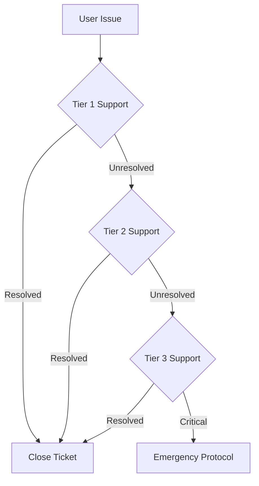

# Support & Escalation Procedures
**Classification:** PUBLIC  
**Last Updated:** 2025-08-12 09:46:21 UTC  
**Author:** @synapsecomics  
**Protocol:** PARANOID  
**Verification:** 〈8〉

## Support Structure

### 1. Support Tiers
```yaml
support_levels:
  tier_1:
    description: "Initial Contact & Basic Support"
    response_time: "4 hours"
    handles:
      - Basic technical issues
      - Account questions
      - General inquiries
      - Community support

  tier_2:
    description: "Technical & Wellness Support"
    response_time: "2 hours"
    handles:
      - Complex technical issues
      - Wellness concerns
      - Security questions
      - System problems

  tier_3:
    description: "Critical & Emergency Support"
    response_time: "30 minutes"
    handles:
      - Security incidents
      - System emergencies
      - Critical wellness issues
      - Major technical failures
```

### 2. Contact Channels
```yaml
channels:
  standard:
    - Email: support@synapse-comics.com
    - Web: support.synapse-comics.com
    - In-Game: Help Center
    - Community: Forums

  urgent:
    - Emergency Line: [ENCRYPTED]
    - Security: security@synapse-comics.com
    - Crisis Support: [ENCRYPTED]
```

## Escalation Procedures

### 1. Standard Escalation


### 2. Emergency Escalation
```yaml
emergency_protocol:
  activation_criteria:
    - Security breach
    - System failure
    - User safety risk
    - Data compromise

  immediate_actions:
    1: Secure affected systems
    2: Notify security team
    3: Implement containment
    4: Begin incident response

  notification_chain:
    1: Security Lead
    2: Technical Director
    3: Community Manager
    4: Legal Team
```

## Response Times

### 1. Standard Issues
| Priority | Initial Response | Resolution Target |
|----------|-----------------|-------------------|
| Low      | 24 hours       | 72 hours         |
| Medium   | 12 hours       | 48 hours         |
| High     | 4 hours        | 24 hours         |
| Urgent   | 1 hour         | 8 hours          |

### 2. Critical Issues
| Type | Response | Containment | Resolution |
|------|----------|------------|------------|
| Security | 15 min | 1 hour | 4 hours |
| Technical | 30 min | 2 hours | 8 hours |
| Wellness | 15 min | 1 hour | Ongoing |

## Issue Categories

### 1. Technical Support
```yaml
technical_issues:
  account:
    - Access problems
    - Authentication issues
    - Profile management
    - Settings configuration

  system:
    - Performance issues
    - Feature bugs
    - Integration problems
    - Update issues

  security:
    - Login concerns
    - Data protection
    - Privacy questions
    - Security alerts
```

### 2. Wellness Support
```yaml
wellness_support:
  personal:
    - Stress management
    - Anxiety support
    - Gaming balance
    - Personal boundaries

  community:
    - Conflict resolution
    - Communication issues
    - Community concerns
    - Social support

  crisis:
    - Emergency support
    - Professional referrals
    - Resource connection
    - Immediate assistance
```

## Documentation Requirements

### 1. Issue Tracking
```yaml
documentation_needs:
  initial:
    - Issue description
    - User information
    - System context
    - Priority level

  ongoing:
    - Action taken
    - Response times
    - Resolution steps
    - Outcome verification

  closure:
    - Resolution details
    - User confirmation
    - Follow-up needs
    - Lesson learned
```

### 2. Report Generation
```yaml
reporting_requirements:
  daily:
    - Open issues
    - Response times
    - Resolution rates
    - Critical incidents

  weekly:
    - Trend analysis
    - Performance metrics
    - Resource utilization
    - Team feedback

  monthly:
    - System health
    - User satisfaction
    - Process improvements
    - Strategic planning
```

## Quality Assurance

### 1. Support Quality
- Regular training
- Performance monitoring
- User feedback
- Process improvement

### 2. Resolution Quality
- Solution verification
- User satisfaction
- Documentation review
- Follow-up checks

---
**VERIFICATION HASH:** [REDACTED]  
**ACCESS:** PUBLIC  

© 2025 Synapse Comics. All Rights Reserved.
〈8〉